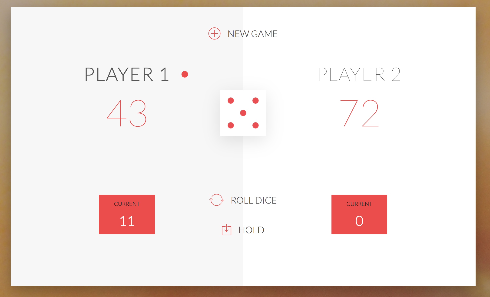

# :game_die: JS-DOM => GAME :game_die:
---

 :memo: Votre mission consiste à la réalisation d'un jeu à l'aide du DOM.
 vous avez le droit d'utiliser :

  * [x] HTML :beer:
  * [x] CSS :beer:
  * [x] JS :beers:

####  :confetti_ball: RÈGLES :confetti_ball::

* Le jeu a 2 joueurs, jouant chacun leur tour
* À chaque tour, un joueur lance un dés autant de fois qu'il souhaite. Chaque résultat est ajouté à son score `ROUND`.
* MAIS, si le joueur roule le dès et qu'il fait 1,  son score `ROUND` se perd. Après cela, c'est le tour du prochain joueur
* Le joueur peut choisir 'Hold', ce qui signifie que son `ROUND` est ajouté au score `GLOBAL`. Après cela, c'est le tour du prochain joueur.
* Le premier joueur à atteindre 100 points sur `GLOBAL` gagne le jeu.
---
* [ ]:bangbang: Votre Code sera structuré :file_folder:
* [x] Faire du TDD n'est pas obligatoire.:warning:
* [x] Le jeu devra être disponible sur un github-pages :rocket:
* [x] les ressources seront disponible dans le dossier **images**
* ressources :
  - [font LATO](https://fonts.google.com/specimen/Lato)
  - [ framework CSS](http://code.ionicframework.com)
---

#### :construction: TODO :construction::

* :recycle: Forker le repo.
* :arrow_right_hook: Faire une branch
*  :twisted_rightwards_arrows: Faire une `PR` sur le repo Originel.

### :checkered_flag: LE PROJET EST A RENDRE POUR DIMANCHE MINUIT :checkered_flag:

> 'BON CHANCE'
